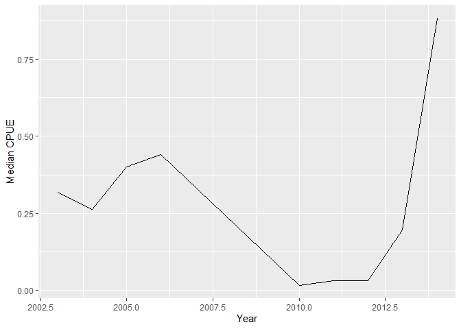
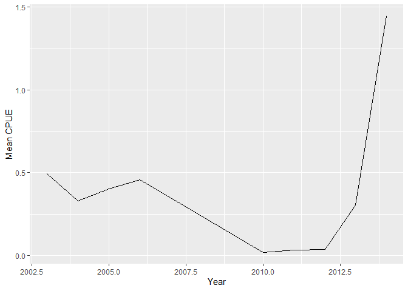
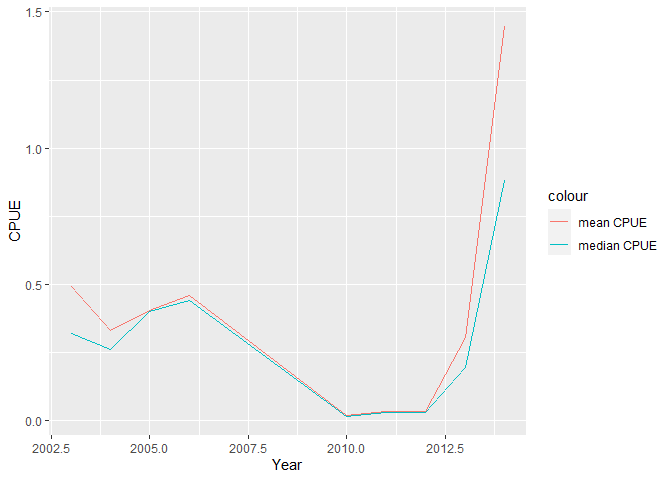

Basic Fisheries Stats
================

``` r
library('readr')
library('ggplot2')
library('magrittr')
library('tidyverse')
library('lubridate')
library('dplyr')
```

CALCULATING ANNUAL LANDINGS

Import data

``` r
landings_data <- read_csv("sample_landings_data_clean.csv")

landings_data
```

    ## # A tibble: 7,208 x 8
    ##     Year Date       Trip_ID Effort_Hours Gear  Species       Length_cm Weight_g
    ##    <dbl> <date>       <dbl>        <dbl> <chr> <chr>             <dbl>    <dbl>
    ##  1  2003 2003-04-30       1           10 trap  Caesio cuning        36    1089.
    ##  2  2003 2003-04-30       1           10 trap  Caesio cuning        29     565.
    ##  3  2003 2003-04-30       1           10 trap  Caesio cuning        34     916.
    ##  4  2003 2003-04-30       1           10 trap  Caesio cuning        36    1089.
    ##  5  2003 2003-04-30       1           10 trap  Caesio cuning        34     916.
    ##  6  2003 2003-04-30       1           10 trap  Caesio cuning        28     508.
    ##  7  2003 2003-04-30       1           10 trap  Caesio cuning        30     627.
    ##  8  2003 2003-04-30       1           10 trap  Caesio cuning        27     455.
    ##  9  2003 2003-04-30       1           10 trap  Caesio cuning        33     837.
    ## 10  2003 2003-04-30       1           10 trap  Caesio cuning        35    1000.
    ## # ... with 7,198 more rows

Start with the landings data frame.

Add column for kilograms by dividing gram column by 1000. Group the data
by year. Next, summarise the total annual landings per year

``` r
annual_landings <- landings_data %>% 
  mutate(Weight_kg = Weight_g / 1000) %>%
  group_by(Year) %>% 
  summarize(Annual_Landings_kg = sum(Weight_kg,na.rm=TRUE))
```

Display a table of the annual landings data

``` r
annual_landings
```

    ## # A tibble: 9 x 2
    ##    Year Annual_Landings_kg
    ##   <dbl>              <dbl>
    ## 1  2003              310. 
    ## 2  2004              565. 
    ## 3  2005              163. 
    ## 4  2006               37.1
    ## 5  2010              132. 
    ## 6  2011              157. 
    ## 7  2012              102. 
    ## 8  2013              580. 
    ## 9  2014             1194.

CALCULATING CATCH-PER-UNIT-EFFORT (CPUE)

Start with the landings data frame.

Add column for kilograms by dividing gram column by 1000. Group the data
by year and gear type. Next, summarise the total annual landings per
year and gear type.

``` r
annual_gear_landings <- landings_data %>% 
  mutate(Weight_kg = Weight_g / 1000) %>%
  group_by(Year, Gear) %>% 
  summarize(Annual_Landings_kg = sum(Weight_kg,na.rm=TRUE))
```

Display a table of the annual landings data by gear type

``` r
annual_gear_landings
```

    ## # A tibble: 39 x 3
    ## # Groups:   Year [9]
    ##     Year Gear     Annual_Landings_kg
    ##    <dbl> <chr>                 <dbl>
    ##  1  2003 gillnet               13.4 
    ##  2  2003 handline               2.87
    ##  3  2003 muroami              248.  
    ##  4  2003 trap                  46.2 
    ##  5  2004 gillnet                4.19
    ##  6  2004 handline              57.7 
    ##  7  2004 muroami              371.  
    ##  8  2004 speargun               9.48
    ##  9  2004 trap                 119.  
    ## 10  2004 trolling               4.39
    ## # ... with 29 more rows

PERCENTAGE MATURE

Define m95, the length at which 95% of fish are mature

``` r
m95 = 15.9
```

Start with the landings data frame. Add a column to the data that
indicates whether each length measurement is from a mature or immature
fish. If it is mature, this value should be TRUE; if immature, FALSE.
Group by year so we can see the percent mature for every year. The
percentage mature is equal to the number of mature fish divided by the
total number of fish and multiplied by 100.

``` r
landings_data %>% 
  mutate(Mature = Length_cm > m95) %>% 
  group_by(Year) %>% 
  summarize(Percent_Mature = sum(Mature) / n() * 100) 
```

    ## # A tibble: 9 x 2
    ##    Year Percent_Mature
    ##   <dbl>          <dbl>
    ## 1  2003           98.6
    ## 2  2004           98.6
    ## 3  2005           97.7
    ## 4  2006          100  
    ## 5  2010           91.8
    ## 6  2011           99.8
    ## 7  2012           99.7
    ## 8  2013           99.5
    ## 9  2014           99.6

MEDIAN CPUE

Start with the landings data frame.

Add column for kilograms by dividing gram column by 1000.

Group by year and Trip ID so that you can calculate CPUE for every trip
in every year.

For each year and trip ID, calculate the CPUE for each trip by dividing
the sum of the catch, converted from grams to kilograms, by the trip by
the number of fishing hours.

Next, just group by year so we can calculate median CPUE for each year
across all trips in the year.

Calculate median CPUE for each year.

``` r
cpue_median <- landings_data %>% 
  mutate(Weight_kg = Weight_g / 1000) %>%
  group_by(Year,Trip_ID) %>% 
  summarize(Trip_CPUE = sum(Weight_kg) / mean(Effort_Hours)) %>% 
summarize(Median_CPUE_kg_hour = median(Trip_CPUE))
```

Display a table of the median CPUE data

``` r
cpue_median
```

    ## # A tibble: 9 x 2
    ##    Year Median_CPUE_kg_hour
    ##   <dbl>               <dbl>
    ## 1  2003              0.318 
    ## 2  2004              0.262 
    ## 3  2005              0.401 
    ## 4  2006              0.440 
    ## 5  2010              0.0174
    ## 6  2011              0.0312
    ## 7  2012              0.0312
    ## 8  2013              0.196 
    ## 9  2014              0.882

Plot median CPUE

``` r
ggplot(cpue_median,  aes(x=Year, y= Median_CPUE_kg_hour)) + geom_line() + ylab("Median CPUE")
```

<!-- -->

MEAN CPUE

Calculate mean CPUE for each year.

``` r
cpue_mean <- landings_data %>% 
  mutate(Weight_kg = Weight_g / 1000) %>%
  group_by(Year,Trip_ID) %>% 
  summarize(Trip_CPUE = sum(Weight_kg) / mean(Effort_Hours)) %>% 
summarize(Mean_CPUE_kg_hour = mean(Trip_CPUE))
```

Display a table of the mean CPUE data

``` r
cpue_mean
```

    ## # A tibble: 9 x 2
    ##    Year Mean_CPUE_kg_hour
    ##   <dbl>             <dbl>
    ## 1  2003            0.493 
    ## 2  2004            0.330 
    ## 3  2005            0.403 
    ## 4  2006            0.458 
    ## 5  2010            0.0202
    ## 6  2011            0.0346
    ## 7  2012            0.0357
    ## 8  2013            0.304 
    ## 9  2014            1.45

Plot mean CPUE

``` r
ggplot(cpue_mean,  aes(x=Year, y= Mean_CPUE_kg_hour)) + geom_line() +ylab("Mean CPUE")
```

<!-- -->

Combine mean and median data

``` r
cpue <- merge(cpue_median, cpue_mean)

cpue
```

    ##   Year Median_CPUE_kg_hour Mean_CPUE_kg_hour
    ## 1 2003          0.31834277        0.49271291
    ## 2 2004          0.26233292        0.33026426
    ## 3 2005          0.40145105        0.40306645
    ## 4 2006          0.44029501        0.45826093
    ## 5 2010          0.01742840        0.02017149
    ## 6 2011          0.03123217        0.03459737
    ## 7 2012          0.03123217        0.03572839
    ## 8 2013          0.19638408        0.30441449
    ## 9 2014          0.88216281        1.44551002

Plot mean and median CPUE in one graph

``` r
ggplot(cpue,  aes(x=Year)) + geom_line(aes(y= Mean_CPUE_kg_hour, colour = "mean CPUE" )) + geom_line(aes(y= Median_CPUE_kg_hour, colour= "median CPUE")) +ylab("CPUE")
```

<!-- -->
